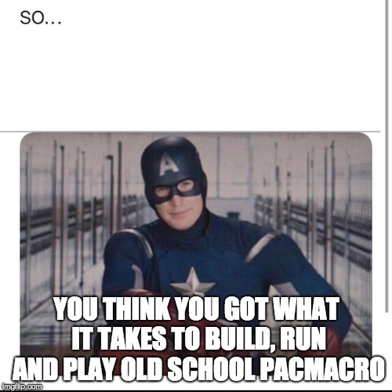

# CSSS PacMacro

  
  
## Table of Contents
 - [Necessary Commands before building the game](#commands-you-need-to-go-through-first-to-before-trying-to-build-the-game)
 - [Building PacMacro](#building-pacmacro)
 - [Potential Library to add after Program built](#potential-library-needed-after-program-is-built)
 - [Potentially Useful Link](#links-that-could-be-useful)
 - [Links to Version 2](https://github.com/pacmacro)  
   - [Server-Code](https://github.com/pacmacro/pm-server)
   - [Android App Repo](https://github.com/pacmacro/pm-android)
   - [iOS App Repo](https://github.com/pacmacro/pm-iOS)
   - [PacMacro Specification](https://github.com/pacmacro/pm-specification)


This game was built on Ubuntu 16.04 due to a dependency that exists on an old websockets library.

## Commands you need to go through first to before trying to build the game

>Recommend to run `apt-get update` before anything else

### 1. Installing jansson-2.11
```shell
wget http://www.digip.org/jansson/releases/jansson-2.11.tar.bz2
bunzip2 -c jansson-2.11.tar.bz2 | tar xf -
cd jansson-2.11
./configure
make
make check
make install
```

### 2. Installing libwebsockets

   2.1. commands to install before installing libwebsockets
```shell
apt-get install -y zlib1g-dev libssl-dev automake libtool
```
   2.2. install libwebsockets [instructions can also be found in `README.install` in `libwebsockets-1.22-chrome26-firefox18` folder]
```shell
cd ~/
wget https://github.com/warmcat/libwebsockets/archive/v1.22-chrome26-firefox18.tar.gz
tar -xzf v1.22-chrome26-firefox18.tar.gz
cd libwebsockets-1.22-chrome26-firefox18/
./autogen.sh
./configure
make
make install
```
   2.3. To test if it was succesful, run `libwebsockets-test-server`. If error arise, run `/sbin/ldconfig -v` to get rid of them

## Building and Setting up PacMacro

3.1 Create PacMacro user and allowing PacMacro user to log in with pubkeys
```shell
useradd -m -d /home/pacmacro -s /bin/bash pacmacro
chown -R pacmacro:pacmacro  /home/pacmacro
chmod 700 /home/pacmacro/.ssh
chmod 0600 /home/pacmacro/.ssh/authorized_keys
echo 'PubkeyAuthentication yes' >> /etc/ssh/sshd_config
```

3.2 install some of the needed commands first
```shell
apt-get install -y git gcc g++ make cmake
```

3.3 Building PacMacro
```
git clone https://github.com/CSSS/PacMacro.git
cd PacMacro
mkdir build
cd build
cmake ..
make
```

3.4 Setting up nodejs and npm to work with PacMacro
```shell
curl -sL https://deb.nodesource.com/setup_10.x | sudo -E bash -
apt-get install -y nodejs
npm install -g pm2
```

3.5 Allow pm2 to run on port 80/433 without root
>Adapted from http://pm2.keymetrics.io/docs/usage/pm2-doc-single-page/#allow-pm2-to-bind-applications-on-ports-80-443-without-root
```shell
echo 'alias pm2="authbind --deep pm2"' >> /home/pacmacro/.bashrc
apt-get install authbind
touch /etc/authbind/byport/80
chown pacmacro /etc/authbind/byport/80
chmod 755 /etc/authbind/byport/80
```
3.6 Setting up the environment
 - Choose a password needed to access the control panel and run: `export PASSWORD='password'` Where password is your chosen password.
 - By default the server will use `port: 80`. If you want to use another port, do so by running the following: `export PORT=port` Where `port` is your chosen port.

## Running PacMacro

1. Running the Server
>Its recommended that you read the basics about [pm2](http://pm2.keymetrics.io/). Home page is enough for basic usage.

```shell
pm2 start server.js
```

2. Running PacMacro
```shell
./pacmacro &
```

## Links that could be useful  
 - https://github.com/creationix/nvm#install-script
 - https://askubuntu.com/questions/849270/how-can-i-install-a-tar-xz-file-from-nodejs-org
 - https://www.digitalocean.com/community/tutorials/how-to-install-node-js-on-ubuntu-16-04
 - https://nodejs.org/en/download/current/
 - https://github.com/warmcat/libwebsockets/tree/v1.22-chrome26-firefox18
 - https://jansson.readthedocs.io/en/2.11/gettingstarted.html#compiling-and-installing-jansson
 - https://www.rosehosting.com/blog/install-npm-on-ubuntu-16-04/
 - https://stackoverflow.com/questions/41195952/updating-nodejs-on-ubuntu-16-04
 - https://unix.stackexchange.com/a/210232